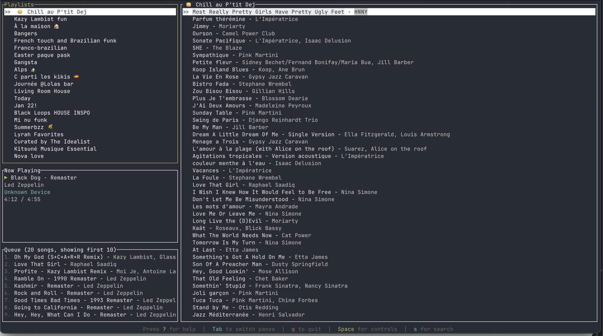

# Spotitui

A Terminal User Interface (TUI) Spotify client built with Rust.



## Features

- **OAuth Authentication**: Login via browser with Spotify OAuth
- **Playlist Management**: Browse your Spotify playlists in the left pane
- **Track Playback**: Play tracks directly from the TUI
- **Now Playing**: Real-time display of currently playing song with progress
- **Playback Controls**: Play/pause, next/previous track controls via popup
- **Queue Management**: View current playback queue and add songs to it
- **Search**: Search all of Spotify for tracks (songs only)
- **Keyboard Navigation**: Navigate between panes and lists with keyboard shortcuts

## Setup

### Prerequisites

1. **Spotify Developer Account**: You need a Spotify Developer account to create an app and get client credentials.

2. **Create a Spotify App**:
   - Go to [Spotify Developer Dashboard](https://developer.spotify.com/dashboard)
   - Create a new app
   - Add `http://127.0.0.1:8888/callback` as a redirect URI
   - Note down your `Client ID` and `Client Secret`

3. **Environment Variables**:
   ```bash
   export SPOTIFY_CLIENT_ID="your_client_id_here"
   export SPOTIFY_CLIENT_SECRET="your_client_secret_here"
   ```

### Installation

1. **Clone and build**:
   ```bash
   cd spotitui
   cargo build --release
   ```

2. **Run**:
   ```bash
   cargo run
   ```

## Usage

### Authentication

The app supports two authentication methods:

**Option A: Automatic (Recommended)**
- The app will automatically open your browser for Spotify authentication
- Grant the required permissions
- You'll see "Authentication successful!" in the browser
- Return to the terminal - the app should now be running!

**Option B: Manual (Fallback)**
If automatic authentication fails:
- The app will provide you with a URL to visit
- Complete authentication in your browser
- The app will automatically detect the redirect and continue

### Keyboard Controls

- **Tab**: Switch between playlists (left) and tracks (right) panes
- **↑/↓** or **Ctrl+P/N**: Navigate up/down in the current pane
- **Enter**:
  - In playlists pane: Load tracks for selected playlist
  - In tracks pane: Play selected track
- **+**: Add selected track to queue (works in both tracks and search results)
- **Space**: Open playback controls popup
- **s**: Open search dialog
- **?**: Show help popup with all keyboard shortcuts
- **q**: Quit application

### Search Mode
- Press **s** to open search
- Type your search query
- Press **Enter** to search
- Navigate results with **↑/↓** or **Ctrl+P/N**
- Press **Enter** to play selected track
- Press **+** to add selected track to queue
- Press **Esc** to exit search mode

### Playback Controls
- Press **Space** to open playback controls popup
- Navigate options with **↑/↓** arrows
- Press **Enter** to execute selected action:
  - **Play/Pause**: Toggle playback state
  - **Previous**: Skip to previous track
  - **Next**: Skip to next track
  - **Close**: Close the popup
- Press **Esc** to close popup

### Help
- Press **?** to show help popup with all keyboard shortcuts
- Press **Esc** or **?** again to close help popup
- Help includes navigation, features, and playback controls


## Requirements

- **Rust** (latest stable version)
- **Spotify Premium** (required for playback control)
- **Active Spotify device** (desktop app, mobile app, or web player)

## Notes

- The app uses Spotify's Web API for playback control
- **You must have an active Spotify device running** (desktop app, mobile app, or web player) for playback to work
- **Spotify Premium is required** for playback control
- Search results are limited to tracks only (no albums, artists, or playlists)
- The app requires internet connection for all operations
- **In-app error handling** - errors are displayed in popup windows within the TUI
- Press any key to dismiss error messages
- **Simple playlist display**: Shows your playlists in Spotify's default order
- **Queue Display**: Shows upcoming tracks in a read-only view
- **API Limitations**: Spotify doesn't support removing individual tracks from queue - only skipping
